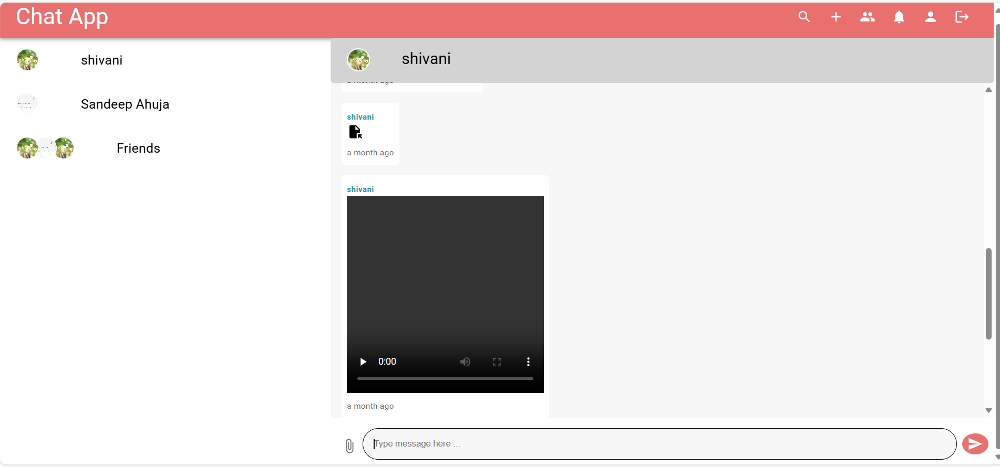

## Chat App



A real time chat application built with the MERN stack and Socket.IO . This chat app supports one to one and group chats , lazy loading of messages , media sharing , authentication and many more features.

## Features 

- **Real time Messaging with Socket.IO** with individual and group chats 
- **Authentication** using JWT based token authentication
- **Multimedia sharing support** including images,files,video and audio
- **Group management** with featuress to add , remove users and rename group name with ease 
- **Lazy loading of messages** to improve performance 
- **Nginx as reverse proxy** for enhancing scalability and load balancing

## Technologies Used

**Frontend** - ReactJS , Redux Toolkit , Socket.IO Client , axios , Material UI

**Backend** - NodeJS , ExpressJS , MongoDB , Socket.IO , Muter and Cloudinary  

## Getting Started

### Environment Variables

Create a .env file in both frontend and backend

#### Backend .env 

   ```
   CLOUDINARY_CLOUD_NAME=your_cloudinary_name
   CLOUDINARY_API_KEY=your_cloudinary_api_key
   CLOUDINARY_API_SECRET=your_cloudinary_secret
   PORT = 5000
   MONGO_URI=your_mongo_connection_string
   JWT_SECRET=your_jwt_secret
   JWT_LIFETIME=your_jwt_lifetime
   FORGET_PASSWORD_JWT_LIFETIME=your_jwt_password_lifetime
   CORS_ORIGIN=frontend_url
   NODE_ENV=DEVELOPMENT | PRODUCTION
   ```

#### Frontend .env 

   ```
   VITE_SERVER = your_backend_url
   ```

### Installation

1. Clone the repository
   ```
   git clone https://github.com/your_github_username/chat-app.git
   ```

2. Install backend dependencies and start backend

   ```
   cd server
   npm install
   npm run dev
   ```

3. Install frontend dependencies and start frontend

   ```
   cd client
   npm install
   npm run dev
   ```


